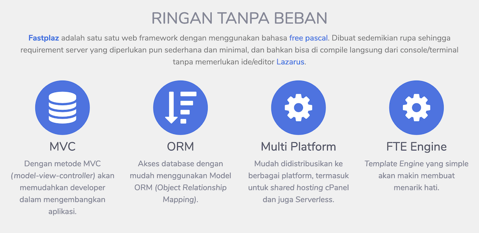
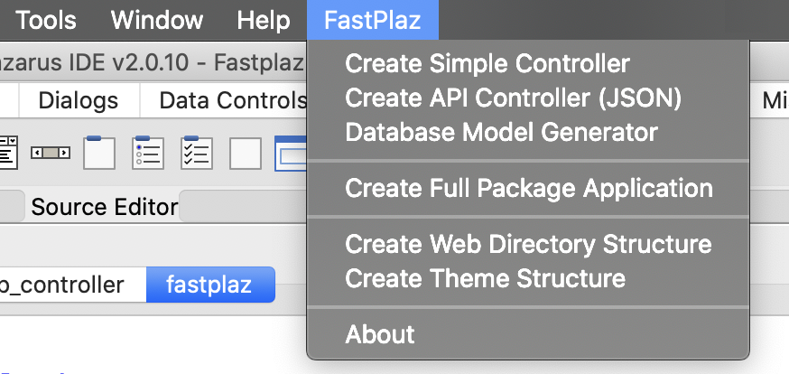
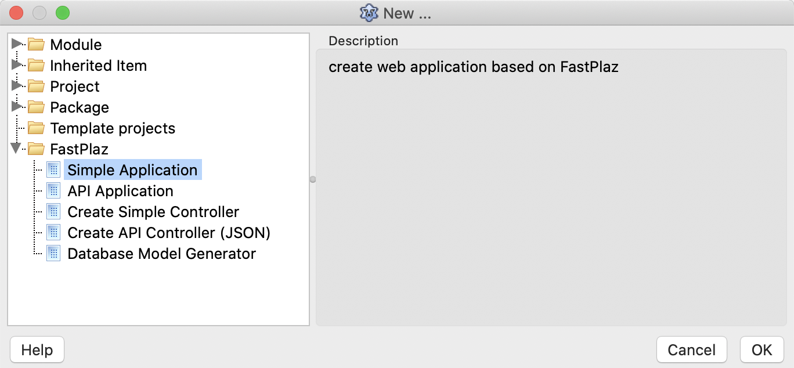

# FastPlaz



**[FastPlaz](https://www.fastplaz.com)** adalah satu satu web framework dengan menggunakan bahasa  free pascal  . Dibuat sedemikian rupa sehingga requirement server yang diperlukan pun sederhana dan minimal, dan bahkan bisa di  compile  langsung dari console/terminal tanpa memerlukan ide/editor  Lazarus. Cukup dengan menggunakan  apache  biasa seperti di shared hosting, fastplaz sudah bisa langsung digunakan.

Desain struktur direktori dan theme/template dibuat sedemikian rupa agar memudahkan dalam melakukan pengembangan aplikasi. 

Tutorial lengkap tentang [FastPlaz](https://www.fastplaz.com) bisa dipelajari melalui situs [fastplaz.github.io](https://fastplaz.github.io/)


## Prerequisite

* FPC / Free Pascal Compiler, version 3.2.2
* Lazarus (optional)


## Persiapan

### Download

Download atau clone terlebih dahulu repositori ini. 

```bash
 git clone -b development https://github.com/fastplaz/fastplaz.git
```

Disarankan menggunakan cara _clone_ ini dibandingkan dengan download manual. Jika nanti ada update atau perubahan, Anda cukup melakukan `pull` saja.

```bash
 git reset --hard HEAD
 git pull
```

Dengan cara ini yang akan diambil hanya perubahannya saja, tidak perlu mengunduh ulang keseluruhan file. Selanjutnya Anda cukup _compile_ ulang saja file-file package-nya.

### Instalasi

Jika Anda adalah pengguna Lazarus, instalasi untuk penggunaan dasar FastPlaz amat sangat mudah, cukup lakukan langkah ini:

1. Buka file `tools/fastplaz_runtime.lpk`, lalu *compile*.
2. Buka file `tools/fastplaz_tools.lpk`, lalu *compile* dan *install*.

Hasilnya akan keluar menu seperti ini di toolbar menu FastPlaz.



Dan akan terlihat tambahan pilihan baru di menu `File|New Project ...` seperti ini




Selamat Mencoba

## Utilitas Pendukung

Beberapa utilitas pendukung untuk pengembangan aplikasi juga telah disediakan.

### Database Explorer


### JSON Validator & Formatter


### Regex Tester


## Related Content

* [FastPlaz Official](https://fastplaz.com)
* [FastPlaz Documentation](https://fastplaz.github.io/)
* [FastPlaz Initiator Github](https://github.com/luridarmawan/)
* [Pascal Indonesia Community](https://pascal-id.org)
* [Free Pascal](https://www.freepascal.org/)
* [Lazarus IDE](https://www.lazarus-ide.org/)


## Contributing
Just make issue and PR if you want to contribute. we will review your PR. See [Contributing Docs](CONTRIBUTING.md).

## License
See [License](LICENSE.txt)


